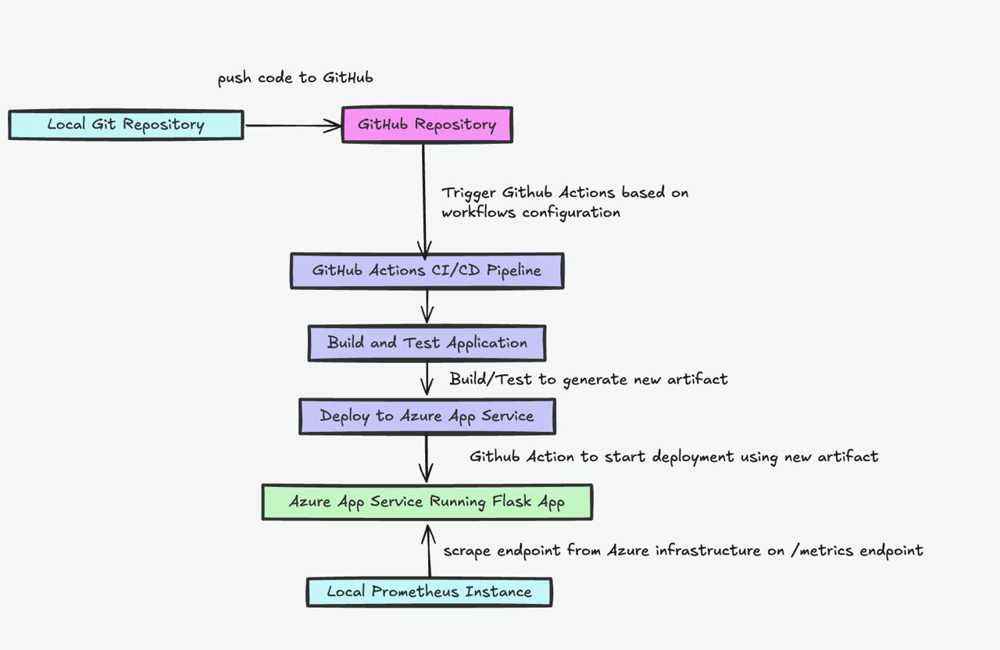
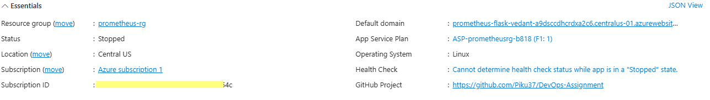

# 📝 Assignment 1 and 2


* * *

### 🛠️ Technical Summary

This project deploys a **Flask web application instrumented with Prometheus metrics** to **Azure App Service** using a **GitHub Actions CI/CD pipeline**. The application exposes key observability metrics such as request counts, response latencies, and HTTP error rates via the `/metrics` endpoint. Prometheus can be configured to scrape these metrics for monitoring and visualization. The deployment uses Python 3.9 on Linux App Service, with all build and release steps automated through GitHub Actions for streamlined delivery.



  

---

## 🛠️ Azure Configuration Used

| Component            | Value                              |
|----------------------|------------------------------------|
| **Resource Group**   | `prometheus-rg`                    |
| **App Service Name** | `prometheus-flask-vedant`          |
| **Region**           | Central India (or your region)     |
| **Runtime**          | Python 3.9, Linux                  |
| **Plan Tier**        |  F1 (Free)                         |
| **Startup Command**  | `gunicorn app:app`                 |

---

## 🧭 Deployment Steps (UI-based)

> **Note:**  
> This deployment was performed using the **Azure Portal UI** due to time constraints. In a production environment, consider using CLI tools (Azure CLI, Terraform, Bicep, etc.) to automate the deployment process.

### ✅ Step 1: Prepare the Application

- **Files Required:**
  - `app.py` (Flask application with the `/metrics` endpoint)
  - `requirements.txt` containing at least:
    ```text
    flask
    prometheus_client
    gunicorn
    ```

- **Screenshot 2**: *screenshot of project folder structure from  IDE.*
  

---

### ✅ Step 2: Push Code to GitHub

- Push your codebase to a GitHub repository ( on the `main` ).

- **Screenshot 3**: *screenshot of  GitHub repository showing  code.*
  

---

### ✅ Step 3: Create Azure App Service

1. **Log in** to the [Azure Portal](https://portal.azure.com/).
2. Navigate to **App Services** → **Create**.
3. Fill out the creation form:
   - **Runtime:** Python 3.9
   - **Operating System:** Linux
   - **Deployment:** Code
   - **Resource Group:** `prometheus-rg`
   - **App Service Name:** `prometheus-flask-vedant`
   - **Region:** Choose your preferred region

- **Screenshot 4**: screenshot of the Azure App Service creation form.*
   


---

### ✅ Step 4: Set Up GitHub Deployment

1. In your newly created App Service, navigate to **Deployment Center**.
2. Choose the following settings:
   - **Source:** GitHub
   - **Repository:** Select your GitHub repository
   - **Branch:** `main`
   - **Build Provider:** GitHub Actions
3. Azure will auto-generate a GitHub Actions workflow file to deploy your application on each push.

- **Screenshot 5**: *a screenshot of the Deployment Center configuration.*
   

- **Screenshot 6**: *screenshot of the  GitHub Actions Secrets in GitHub repository.*
  
 

---

### ✅ Step 5: Configure the Startup Command

1. In the Azure Portal, go to your App Service's **Configuration** > **General Settings**.
2. Set the **Startup Command** to:
   ```bash
   gunicorn app:app

### ✅ Step 6: Test the Application

Once deployment is complete:

- ✅ **Public URL:**

        prometheus-flask-vedant-a9dsccdhcrdxa2c6.centralus-01.azurewebsites.net
- ✅ **Endpoints to test:**

   
    - Metrics:

            prometheus-flask-vedant-a9dsccdhcrdxa2c6.centralus-01.azurewebsites.net/metrics


- **Screenshot 8**: *screenshot showing your app running in the browser.*
  


- **Screenshot 9**: *screenshot showing the `/metrics` Prometheus output.*
 


- **Screenshot 9**: *screenshot showing the graphs output.*
 

**Screenshot 10**: *screenshot showing the target as up.*
 

