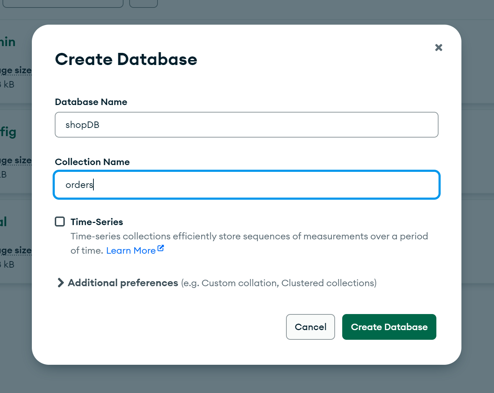
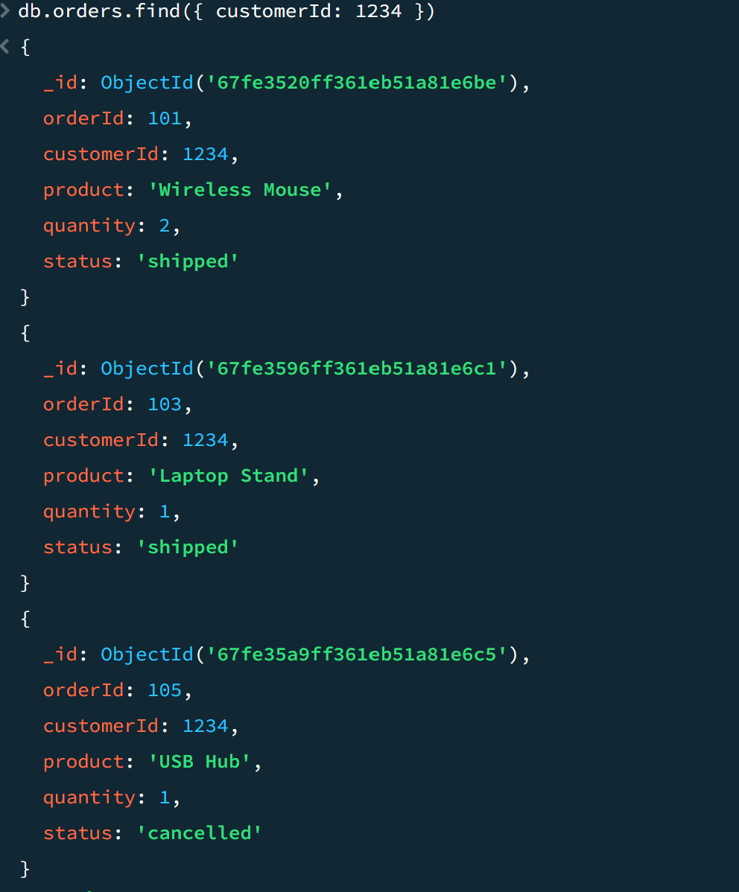
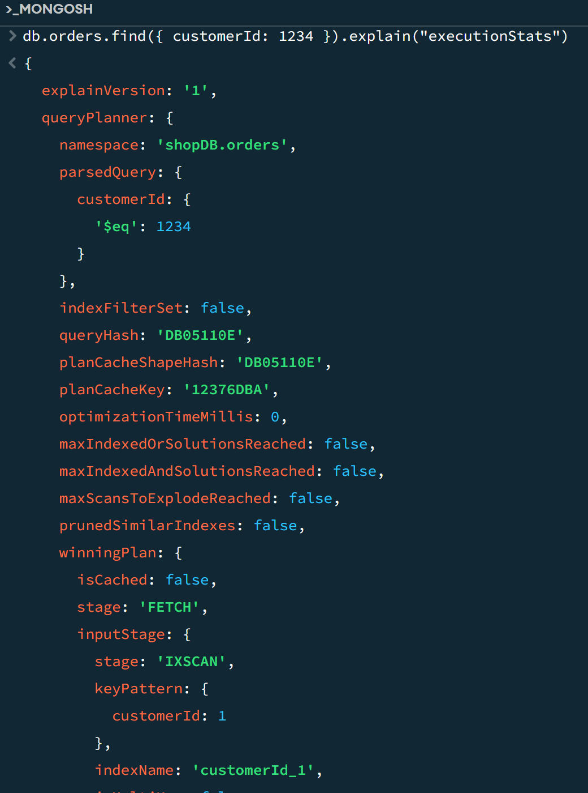

# MongoDB Performance Optimization Documentation

## Step 1: Create MongoDB Database and Collection

### 1.1 Create Database and Collection in *mongosh*

1. Open *mongosh* (MongoDB shell) by typing mongosh in your terminal.
2. Create a database and switch to it:

        use shopDB
3. Create a collection called orders and insert some sample documents:

 ```mongosh
db.orders.insertMany([
  { "orderId": 102, "customerId": 5678, "product": "Keyboard", "quantity": 1, "status": "processing" },
  { "orderId": 103, "customerId": 1234, "product": "Laptop Stand", "quantity": 1, "status": "shipped" },
  { "orderId": 104, "customerId": 9999, "product": "HDMI Cable", "quantity": 3, "status": "delivered" },
  { "orderId": 105, "customerId": 1234, "product": "USB Hub", "quantity": 1, "status": "cancelled" }
])

```
This will insert 4 documents into the orders collection.

*Screenshot for MongoDB shell database creation:*




* * *

## Step 2: Queries for Optimization

### 2.1 Run Query *Before Indexing*

First, run a basic query to check the performance before creating any indexes.

    db.orders.find({ customerId: 1234 })

This query fetches all orders for the customer with customerId: 1234.

*Screenshot for query output before indexing:*



### 2.2 Create Index on customerId

Now, create an index on the customerId field to optimize the query.

    db.orders.createIndex({ customerId: 1 })

This index will help MongoDB search for customer orders faster.


### 2.3 Run the Same Query *After Indexing*

Now, run the same query again and check the execution stats.

    db.orders.find({ customerId: 1234 }).explain("executionStats")

In the output, look for "stage": "IXSCAN" — indicating the query is now using the index for faster execution.

*Screenshot for query output after indexing:*



* * *

### 2.4 Query Optimization with Projection

Instead of fetching all the fields, you can project only the necessary fields (e.g., orderId and product).

    db.orders.find( { customerId: 1234 }, { _id: 0, orderId: 1, product: 1 })

This reduces the amount of data being retrieved.

